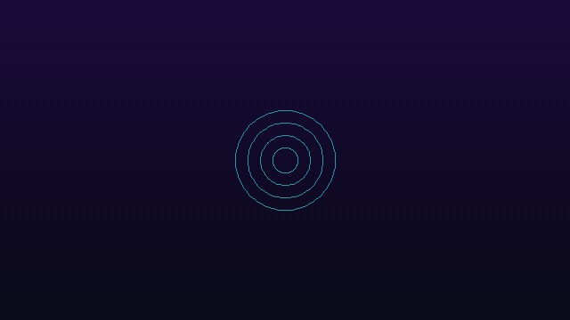

# Vizcore [](https://badge.fury.io/rb/vizcore) [](https://github.com/ydah/vizcore/actions/workflows/main.yml)

Vizcore is a Ruby gem for audio-reactive VJ visuals. Define scenes in Ruby, stream them to a browser renderer, and map audio analysis, beats, MIDI, OSC, and live controls to visual parameters.

<p align="center">
  
</p>

## Install

Requirements:

- Ruby `>= 3.2`
- PortAudio for microphone input
- ffmpeg for MP3/FLAC input and MP4 output
- fftw3 optional for faster FFT analysis

```bash
# macOS
brew install portaudio ffmpeg
brew install fftw # optional

# Ubuntu / Debian
sudo apt install -y libportaudio2 libportaudio-dev ffmpeg
sudo apt install -y libfftw3-dev # optional
```

```bash
gem install vizcore
# or
bundle add vizcore
```

## Quick Start

```bash
vizcore doctor
vizcore demo
```

Open `http://127.0.0.1:4567`.

To run a scene file directly:

```bash
vizcore start examples/basic.rb
vizcore start examples/vj_techno_warehouse.rb --audio-source file --audio-file examples/assets/complex_demo_loop.wav
```

## Minimal Scene

Scenes are plain Ruby files:

```ruby
Vizcore.define do
  scene :readme_demo do
    layer :beat_rings do
      palette "#24f6ff", "#ff2bbd", "#caff2e"

      circle count: 4 do
        radius 92
        stroke 3
        map beat_pulse,
            to: :radius,
            gain: 160.0,
            min: 56,
            max: 164,
            attack: 1.0,
            release: 0.2
      end
    end
  end
end
```

Run it with:

```bash
vizcore start scene.rb
```

## Useful Commands

```bash
vizcore start SCENE_FILE
vizcore start --manifest vizcore.yml
vizcore gallery
vizcore validate SCENE_FILE
vizcore devices audio
vizcore devices midi
vizcore snapshot SCENE_FILE --out screenshot.png
```

Use `vizcore help` for the full CLI.

Browser routes:

- `/` visual output with operator controls
- `/projector` clean projection output
- `/control` separate operator panel

## Documentation

- Project site: <https://ydah.github.io/vizcore/>
- Examples: [examples/README.md](examples/README.md)
- Changelog: [CHANGELOG.md](CHANGELOG.md)
- Runtime layer reference: `vizcore layers`
- Ruby DSL reference: `vizcore dsl-docs`
- Shader uniform reference: `vizcore shader-docs`

## Development

```bash
bundle install
npm install --prefix frontend
bundle exec rspec
npm --prefix frontend test
bundle exec rake release:verify
```

## License

MIT
